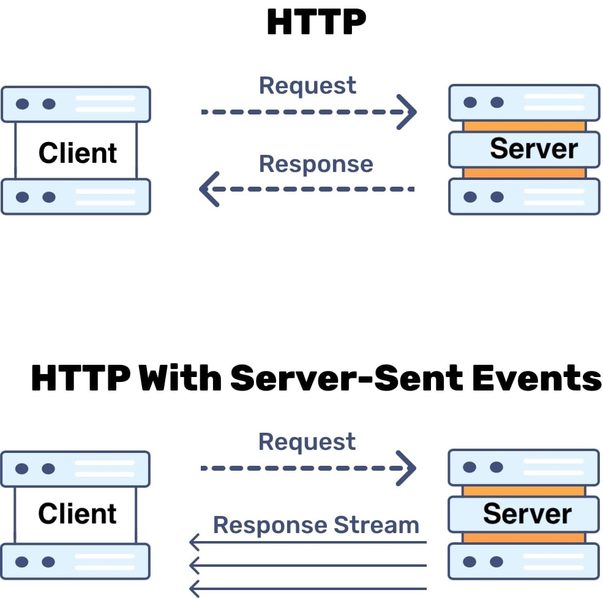

# Server Sent Event Golang

How to sent message from server to client ?
you can use alternative SSE (Server Sent Event)





## Usage/Examples

Run Program

```shell
go run main.go
```

Example Send Event with trigger http call

POST http://localhost:4444/api/sse

```json
{
    "message" :"NandaRusfikri"
}
```

